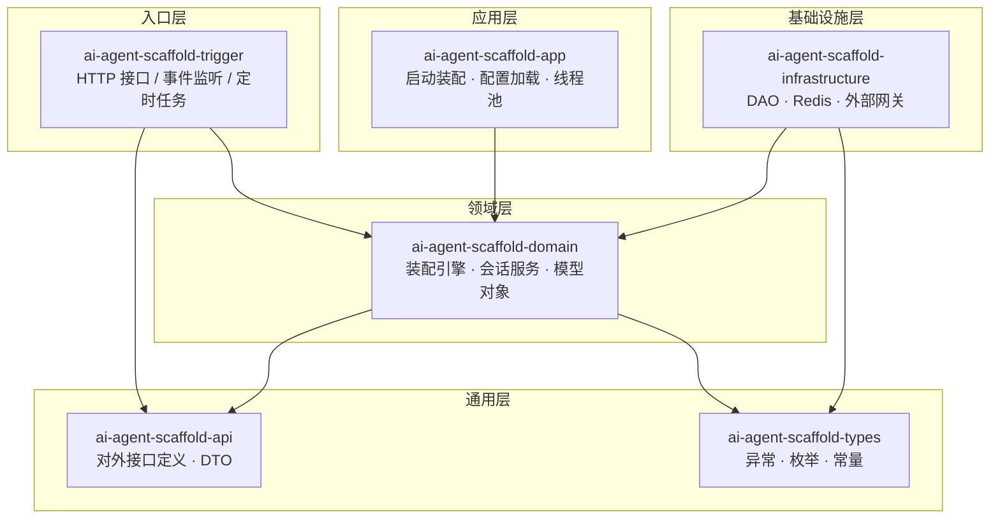
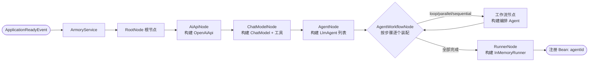
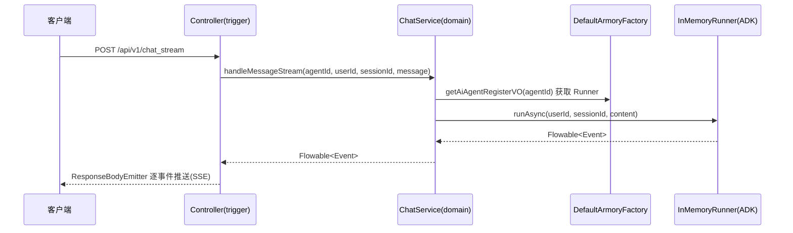

# AI Agent Scaffold · 智能体装配脚手架

> 一个基于 **DDD 分层架构 + 策略树设计模式** 的 AI 智能体（Agent）装配与运行脚手架：
> 通过 **YAML 配置驱动**，在应用启动时自动完成「LLM 模型 → 工具（MCP/Skills）→ 智能体（Agent）→ 工作流（串行/并行/循环）→ 执行器（Runner）」的全链路装配，
> 并提供会话管理与同步/流式对话 HTTP 接口。

---

## 目录

- [项目亮点](#项目亮点)
- [核心特性](#核心特性)
- [技术栈](#技术栈)
- [架构设计](#架构设计)
- [目录结构](#目录结构)
- [内置示例智能体](#内置示例智能体)
- [快速开始](#快速开始)
- [API 接口](#api-接口)

---

## 项目亮点

- **配置驱动、零代码注册**：新增一个智能体只需编写一个 YAML 片段，启动时自动装配并注册为 Spring Bean，无需改动任何 Java 代码
- **策略树装配引擎**：基于 `StrategyHandler` 抽象构建多节点责任链，AiApi → ChatModel → Agent → Workflow → Runner 逐级装配，节点可插拔、可扩展
- **三种 Agent 工作流编排**：串行（Sequential）、并行（Parallel）、循环（Loop，含最大迭代次数控制与退出工具），可任意嵌套组合
- **丰富的工具接入**：MCP 客户端（SSE / Stdio / 本地）、目录/资源型 Skills、回调 Plugin，统一收敛为 Spring AI `ToolCallback`
- **同步 + 流式双模式对话**：基于 RxJava `Flowable` + `ResponseBodyEmitter` 实现 SSE 流式输出，多模态消息（文本/URI/文件/内联数据）支持
- **工业级工程化**：DDD 六层模块拆分、多环境配置（dev/test/prod）、Docker 化部署、Git 分支式迭代开发（每步一个 feature 分支 + PR 合入）

---

## 核心特性

| 特性 | 说明 |
| --- | --- |
| 智能体装配引擎 | 启动时（`ApplicationReadyEvent`）读取 `ai.agent.config.tables` 配置，走策略树完成装配 |
| 多 Agent 编排 | LlmAgent（单智能体）、SequentialAgent（串行流水线）、ParallelAgent（并行分发）、LoopAgent（循环迭代） |
| MCP 工具 | SSE（如百度 AI 搜索）、Stdio（本地进程，如天气查询服务）、本地 MCP 三种客户端，工厂模式分发 |
| Skills 技能 | 目录（directory）/ 资源（resource）两种来源，接入 `SkillsTool` |
| Plugin 插件 | 按 bean 名从 Spring 容器装配 ADK 回调插件（如日志插件） |
| 会话服务 | 用户维度会话创建与复用（内存态），基于 ADK `InMemoryRunner` |
| 对话能力 | 同步返回 + 流式 SSE 推送；支持文本、图片 URI、文件、内联字节等多模态输入 |
| HTTP API | 查询智能体列表 / 创建会话 / 对话 / 流式对话，统一 `Response` 响应体 |
| 工程底座 | MyBatis + MySQL + Redis、线程池、Guava、logback 多环境日志（可按需启用） |

---

## 技术栈

| 分类 | 技术 | 版本 |
| --- | --- | --- |
| 语言/构建 | Java / Maven（多模块） | 17 / 3.x |
| 基础框架 | Spring Boot | 3.4.3 |
| AI 编排 | Google ADK（Agent Development Kit） | 1.1.0 |
| LLM 接入 | Spring AI（OpenAI 兼容协议） | 1.1.0-M3 |
| 工具协议 | MCP（Model Context Protocol） | 官方 SDK |
| 设计模式框架 | xfg-wrench-starter-design-framework（策略树） | 3.0.0 |
| 响应式 | RxJava 3 | 3.x |
| 序列化 | Fastjson2 | 2.0.28 |
| 数据/缓存 | MySQL / Redis（脚手架预留，可按需开启） | - |
| 部署 | Docker / docker-compose | - |

> 说明：`ai-agent-scaffold-app/pom.xml` 同时引入了 LangChain4j 1.4.0 与 spring-ai-agent-utils，用于模型 API 层的能力对比验证（见 `src/test` 下的 API 测试）。

---

## 架构设计

### 一、DDD 分层架构

严格遵循 DDD 分层与依赖倒置原则，依赖方向由外向内单向流动：



### 二、智能体装配引擎（Armory）

应用启动后，每个智能体配置（一个 `table`）都会走一遍策略树完成装配，最终注册为 Spring 容器中的一个 Bean（`AiAgentRegisterVO`）：



### 三、运行时对话链路



---

## 目录结构

```
ai-agent-scaffold
├── ai-agent-scaffold-api               # 对外服务接口 + DTO + 统一响应体
│   └── IAgentService.java              #   智能体服务接口定义
├── ai-agent-scaffold-trigger           # 入口层：HTTP 接口实现
│   └── AgentServiceController.java     #   /api/v1 智能体接口
├── ai-agent-scaffold-app               # 应用层：启动装配、配置、线程池
│   ├── AiAgentAutoConfig.java          #   监听启动事件，触发智能体装配
│   └── resources/agent/*.yml           #   智能体 YAML 配置（示例）
├── ai-agent-scaffold-domain            # 领域层：核心业务
│   └── agent/
│       ├── service/armory/             #   装配引擎（策略树节点 + 工厂）
│       ├── service/chat/               #   会话服务（同步/流式/多模态）
│       └── model/                      #   实体、值对象、聚合
├── ai-agent-scaffold-infrastructure    # 基础设施层（预留：DAO/Redis/网关）
├── ai-agent-scaffold-types             # 通用层：异常、枚举、常量
├── docs/
│   └── dev-ops/                        #   部署：docker-compose、SQL、脚本
└── pom.xml                             # Maven 父工程
```

---

## 内置示例智能体

项目内置 4 个示例配置，覆盖了全部核心能力（配置见 `ai-agent-scaffold-app/src/main/resources/agent/`）：

| 智能体 | agentId | 演示能力 |
| :-- | --- | --- |
| 测试智能体01 | 100001 | **串行工作流**：CodeWriter → CodeReviewer → CodeRefactorer 三段式代码生成流水线 + 百度搜索 MCP（SSE） |
| 天气查询智能体 | 100002 | **Stdio MCP 工具**：调用本地 Python 天气服务进程查询实时天气 |
| 测试智能体03 | 100003 | **嵌套工作流**：3 个研究员并行调研（Parallel）→ 汇总报告（Sequential） |
| 测试智能体04 | 100004 | **工具全家桶**：SSE MCP + 本地 MCP + Skills + Plugin 回调 |

---

## 快速开始

### 环境要求

- JDK 17+
- Maven 3.6+
- （可选）MySQL 8 / Redis / Docker

### 1. 配置密钥（secret.yml）

项目密钥统一存放在 `ai-agent-scaffold-app/src/main/resources/secret.yml`（已被 `.gitignore` 忽略，不会提交到 git）：

```bash
# 复制模板并填入真实密钥
cp src/main/resources/secret.yml.example src/main/resources/secret.yml
```

```yaml
# secret.yml 内容
MIMO_API_KEY: "你的 LLM 厂商密钥"        # 小米 MiMo 或任意 OpenAI 兼容服务
BAIDU_MCP_API_KEY: "你的百度搜索 MCP 密钥" # 使用示例中的搜索工具时需要
DEEPSEEK_API_KEY: "你的 DeepSeek 密钥"      # 本地测试脚本使用
```

> 密钥通过 `application-dev.yml` 的 `spring.config.import: optional:classpath:secret.yml` 加载；
> `optional:` 前缀保证文件缺失时应用仍可启动（此时密钥为空）。换机器时只需复制 `secret.yml.example` 改名填写。

### 2. 编译启动

```bash
mvn clean install -DskipTests
mvn -pl ai-agent-scaffold-app spring-boot:run
```

启动日志可见智能体装配过程：`Ai Agent 装配操作 - AiApiNode / ChatModelNode / AgentNode ...`，以及 `成功注册Bean: 100001`。

### 3. 体验对话

```bash
# 查询智能体列表
curl http://127.0.0.1:8091/api/v1/query_ai_agent_config_list

# 创建会话（不传 sessionId 时 chat 接口会自动创建）
curl -X POST http://127.0.0.1:8091/api/v1/create_session \
  -H "Content-Type: application/json" \
  -d '{"agentId":"100001","userId":"stu001"}'

# 同步对话
curl -X POST http://127.0.0.1:8091/api/v1/chat \
  -H "Content-Type: application/json" \
  -d '{"agentId":"100001","userId":"stu001","sessionId":"<上一步返回>","message":"写一个 Java 阶乘函数"}'

# 流式对话（SSE）
curl -N -X POST http://127.0.0.1:8091/api/v1/chat_stream \
  -H "Content-Type: application/json" \
  -d '{"agentId":"100002","userId":"stu001","sessionId":"<上一步返回>","message":"北京今天天气怎么样"}'
```

### 4. 新增一个自己的智能体

在 `ai-agent-scaffold-app/src/main/resources/agent/` 下新建 `my-agent.yml`，并在 `application-dev.yml` 的 `spring.config.import` 中追加该文件：

```yaml
ai:
  agent:
    config:
      tables:
        myAgent:
          app-name: myAgent
          agent:
            agent-id: 200001
            agent-name: 我的第一个智能体
            agent-desc: 演示如何零代码新增智能体
          module:
            ai-api:
              base-url: [替换为你的ai-LLM-baseurl]
              api-key: ${MIMO_API_KEY}   # 从 secret.yml 读取，勿硬编码
              completions-path: v1/chat/completions
              embeddings-path: v1/embeddings
            chat-model:
              model: [替换为你的ai-LLM模型]
            agents:
              - name: AnswerAgent
                description: 回答用户问题
                instruction: |
                  你是一个乐于助人的助手，用中文简洁回答用户的问题。
            runner:
              agent-name: AnswerAgent
```

重启应用后，`200001` 即自动注册为可用的智能体

---

## API 接口

| 接口 | 方法 | 说明 |
| --- | --- | --- |
| `/api/v1/query_ai_agent_config_list` | GET | 查询已装配的智能体配置列表 |
| `/api/v1/create_session` | POST | 创建（或复用）用户会话，返回 sessionId |
| `/api/v1/chat` | POST | 同步对话，返回完整回复 |
| `/api/v1/chat_stream` | POST | 流式对话，SSE 逐事件推送 |

统一响应体：

```json
{
  "code": "0000",
  "info": "成功",
  "data": {}
}
```
